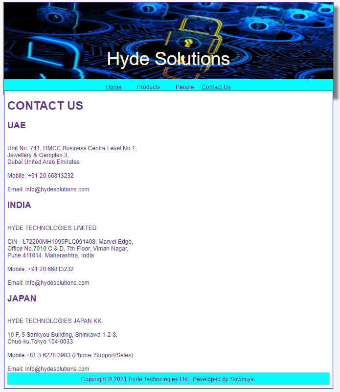

# Web Design for a Software Product Company

## AIM:

To design a static website for a software product company company.

## DESIGN STEPS:

### Step 1:

Requirement collection.

### Step 2:

Creating the layout using HTML and CSS.

### Step 3:

Updating the sample content.

### Step 4:

Choose the appropriate style and color scheme.

### Step 5:

Validate the layout in various browsers.

### Step 6:

Validate the HTML code.

### Step 6:

Publish the website in the given URL.

## PROGRAM :

### Css code:
```
* {
  box-sizing: border-box;
  font-family: Arial, Helvetica, sans-serif;
}
body {
  background-color: whitesmoke;
  color:rebeccapurple;
  
}
.container {
  width: 1080px;
  margin-left: auto;
  margin-right: auto;
  border-width: 1px 1px 1px 1px;
  border-style: solid;
  box-shadow: 15px 15px 8px gray;
}

.topbg {
  display: block;
  width: 100%;
  height: 250px;
  text-align: center;
  font-size: 60px;
  background-image: url("/static/img/topbg.jpg");
  background-size: 100% 100%;
  margin: 0px 0px 0px 0px;
  padding-top: 150px;
  color: cornsilk;
}
.bgimg {
  background-image: url("static/img/topbg.jpg");
}

.menu {
  display: block;
  width: 100%;
  height: 50px;
  font-size: larger;
  background-color: cyan;
  text-align: center;
  padding-top: 15px;
  margin: 0px 0px 0px 0px;
  border-width: 1px;
}

.menuitem {
  display: inline-block;
  margin-left: 10px;
  margin-right: 10px;
}
.menuitemselected {
  display: inline-block;
  margin-left: 10px;
  margin-right: 10px;
  color: rgb(149, 10, 241);
}

.menuitem a {
  text-decoration: none;
  color: purple;
}

.content {
  display: block;
  width: 100%;
  background-color: white;
  min-height: 500px;
  margin: 0px 0px 0px 0px;
  border-width: 1px;
  border-color: rgb(10, 6, 243);
  border-style: solid;
}
.homecontent {
  min-height: 500px;
  margin: 10px 10px 10px 10px;
}
.homecontent h1 {
  text-align: left;
}
.homecontent img {
  float: right;
  width: 400px;
  height: 300px;
  margin-left: 10px;
}

.contenttext {
  text-align: justify;
}

.productcontent {
  min-height: 500px;
  margin: 10px 10px 10px 10px;
}

.productcontent h1 {
  text-align: left;
}

.productitems {
  display: block;
}

.productitem {
  display: inline-block;
  width: 30%;
  height: 250px;
  text-align: center;
}

.productitem img {
  width: 100px;
  height: 100px;
  display: block;
}
.productitem .itemimage {
  display: block;
  margin-left: auto;
  margin-right: auto;
  width: 100px;
  margin-bottom: 5px;
}

.productitem .itemname {
  display: block;
}
.productitem .itemprice {
  display: block;
}


.peoplecontent {
  min-height: 500px;
  margin: 10px 10px 10px 10px;
}

.peoplecontent h1 {
  text-align: left;
}

.peopleitems {
  display: block;
}

.peopleitem {
  display: block;
  width: 30%;
  height: 250px;
  text-align: center;
}

.peopleitem img {
  width: 100px;
  height: 100px;
  display: block;
}
.peopleitem .peopleimage {
  display: block;
  margin-left: auto;
  margin-right: auto;
  width: 100px;
  margin-bottom: 5px;
}

.peopleitem .peoplename {
  display: block;
}
.peopleitem .peoplepos{
  display: block;
}


.Contactcontent {
  min-height: 500px;
  margin: 10px 10px 10px 10px;
}

.Contactcontent h1 {
  text-align: left;
}

.Contactitems {
  display: block;
}

.Contactitem {
  display:block;
  text-align: left;
}

.Contactitem .conadd {
  display: block;
  text-align: left;
}
.Contactitem .connum {
  display: block;
  text-align: left;
}
.Contactitem .conem {
  display: block;
  text-align: left;
}

.footer {
  display: block;
  width: 100%;
  height: 40px;
  background-color:  cyan;
  text-align: center;
  padding-top: 10px;
  margin: 0px 0px 0px 0px;
  color:purple;
}

```
 ### Home page html Code:
 ```
 <!DOCTYPE html>
<html lang="en">
  <head>
    <title>Hyde Solutions</title>
    <link rel="stylesheet" href="./css/layout.css" />
    <link rel="icon" href="./img/hydeicon.jpeg" type="image/x-icon" />
  </head>

  <body>
    <div class="container">
      <div class="topbg">Hyde Solutions</div>
      <div class="menu">
        <div class="menuitemselected"><a href="/static/home.html">Home</a></div>
        <div class="menuitem"><a href="/static/products.html">Products</a></div>
        <div class="menuitem"><a href="/static/people.html">People</a></div>
        <div class="menuitem"><a href="/static/Contact.html">Contact Us</a></div>
      </div>
      <div class="content">
        <div class="homecontent">
          <h1>About Us</h1>
          
          <div class="contenttext">
            Hyde Technologies Ltd. is the pioneer of antivirus research and development in India and has set the benchmark of computer security standards.

Founded in 1995, it is one of the most trusted brands for IT Security.
            <br />
            <h2>CORE PURPOSE</h2><br>
Innovate to "simplify" securing digital experience.<br/>

            <h2>MISSION</h2><br/>
Empowering the team to solve business problems.<br/>

            <h2>VISION</h2><br/>
To be trusted by our customers in securing the digital world and aim to grow as reputable global market leader.<br/>

             <h2>WHAT MAKES US DIFFERENT</h2><br/>
We strive to solve complex problems with the simplest solutions by keeping in mind the unique needs of our customers. Hyde is a smart, easy to use and an extremely fuss-free product for your everyday protection against IT threats and viruses. That makes us one of the most trusted Antivirus brands in home users.<br/>
              <h1>STAY AWARE. STAY SECURE.</h1>

          </div>
        </div>
      </div>
      <div class="footer">
        Copyright &#169; 2021 Hyde Technologies Ltd., Developed by Sowmiya.
      </div>
    </div>
  </body>
</html>

 ```
  ### Products page html Code:
  ```
<!DOCTYPE html>
<html lang="en">
  <head>
    <title>Hyde Solutions</title>
    <link rel="stylesheet" href="./css/layout.css" />
    <link rel="icon" href="./img/hydeicon.jpeg" type="image/x-icon" />
  </head>

  <body>
    <div class="container">
      <div class="topbg">Hyde Solutions</div>
      <div class="menu">
        <div class="menuitem"><a href="/static/home.html">Home</a></div>
        <div class="menuitemselected">
          <a href="/static/products.html">Products</a>
        </div>
        <div class="menuitem"><a>People</a></div>
        <div class="menuitem"><a>Contact Us</a></div>
      </div>
      <div class="content">
        <div class="productcontent">    
          <h1>Our Premium Products</h1>
          <div class="productitems">
              <div class="productitem"> 
                  <div class="itemimage">
                  
                  </div>
                  <div class="itemname">Total Security</div>
                  <div class="itemprice">Price: Rs.2,000.00 </div>
              </div>
              <div class="productitem"> 
                  <div class="itemimage">
                  
                  </div>
                  <div class="itemname">Internert Security for MAC</div>
                  <div class="itemprice">Price: Rs.7,500.00 </div>
              </div>
              <div class="productitem"> 
                <div class="itemimage">
                
                </div>
                <div class="itemname">Internet Security</div>
                <div class="itemprice">Price: Rs.9,500.00 </div>
              </div>
              <div class="productitem"> 
                <div class="itemimage">
                
                </div>
                <div class="itemname">AntiVirus for Server</div>
                <div class="itemprice">Price: Rs.6,000.00 </div>
              </div>
              <div class="productitem"> 
                <div class="itemimage">
                
                </div>
                <div class="itemname">Mobile Security</div>
                <div class="itemprice">Price: Rs.9,000.00 </div>
              </div>
              <div class="productitem"> 
                <div class="itemimage">
                
                </div>
                <div class="itemname">Heal PCTuner</div>
                <div class="itemprice">Price: Rs.11,000.00 </div>
              </div>
              <div class="productitem"> 
                <div class="itemimage">
                
                </div>
                <div class="itemname">Cryptography and Network</div>
                <div class="itemprice">Price: Rs.8,000.00 </div>
              </div>
              <div class="productitem"> 
                <div class="itemimage">
                
                </div>
                <div class="itemname">Total Security for Android</div>
                <div class="itemprice">Price: Rs.7,000.00 </div>
              </div>
              <div class="productitem"> 
                <div class="itemimage">
                
                </div>
                <div class="itemname">Cyber Security</div>
                <div class="itemprice">Price: Rs.8,000.00 </div>
              </div>
              <div class="productitem"> 
                <div class="itemimage">
                
                </div>
                <div class="itemname">The Code Book</div>
                <div class="itemprice">Price: Rs.10,000.00 </div>
              </div>
              <div class="productitem"> 
                <div class="itemimage">
                
                </div>
                <div class="itemname">Hacking</div>
                <div class="itemprice">Price: Rs.4,000.00 </div>
              </div>
              <div class="productitem"> 
                <div class="itemimage">
                
                </div>
                <div class="itemname">AntiVirus Pro</div>
                <div class="itemprice">Price: Rs.9,999.00 </div>
              </div>
          </div>
          </div>        
      </div>
      <div class="footer">
        Copyright &#169; 2021 Hyde Technologies Ltd., Developed by Sowmiya.
      </div>
    </div>
  </body>
</html>

  ```
 ### People page html Code:
```
<!DOCTYPE html>
<html lang="en">
  <head>
    <title>Hyde Solutions</title>
    <link rel="stylesheet" href="./css/layout.css" />
    <link rel="icon" href="./img/hydeicon.jpeg" type="image/x-icon" />
  </head>

  <body>
    <div class="container">
      <div class="topbg">Hyde Solutions</div>
      <div class="menu">
        <div class="menuitem"><a href="/static/home.html">Home</a></div>
        <div class="menuitemselected">
        <div class="menuitem"><a href="/static/products.html">Products</a></div>
        <div class="menuitemselected">
            <a href="/static/people.html">People</a>
        </div>
        </div>
        <div class="menuitem"><a>Contact Us</a></div>
      <div class="content">
        <div class="peoplecontent"> 
            <h1>PEOPLE-Our Team</h1>
            <div class="peopleitems">
                <div class="peopleitem">
                    <div class="peopleimage">
                    
                    </div>
                    <div class="peoplename">MR.Deniz</div>
                    <div class="peoplepos">MD and CEO</div>
                </div>
                <div class="peoplecontent"> 
                  <div class="peopleitems">
                      <div class="peopleitem"> 
                          <div class="peopleimage">
                          
                          </div>
                          <div class="peoplename">MR.Albert</div>
                          <div class="peoplepos">CPO</div>
                      </div>
                      <div class="peoplecontent">   
                      
                        <div class="peopleitems">
                            <div class="peopleitem"> 
                                <div class="peopleimage">
                                
                                </div>
                                <div class="peoplename">MS.Filiz</div>
                                <div class="peoplepos">CHRO</div>
                            </div>
                      
                        <div class="peoplecontent">  
                                
                                    <div class="peopleitems">
                                        <div class="peopleitem"> 
                                            <div class="peopleimage">
                                            
                                            </div>
                                            <div class="peoplename">MR.Sylvester</div>
                                            <div class="peoplepos">Joint MD and CTO</div>
                              </div>
                        <div class="peoplecontent"> 
                                          
                                          <div class="peopleitems">
                                              <div class="peopleitem"> 
                                                  <div class="peopleimage">
                                                  
                                                  </div>
                                                  <div class="peoplename">MR.William</div>
                                                  <div class="peoplepos">Head,Retail Sales</div>
                               </div>
                               <div class="peoplecontent">    
                           
                                <div class="peopleitems">
                                    <div class="peopleitem"> 
                                        <div class="peopleimage">
                                        
                                        </div>
                                        <div class="peoplename">Ms.Olivia</div>
                                        <div class="peoplepos">CFO</div>
                     </div>


                
          </div>
        </div>
      <div>
      <div class="footer">
        Copyright &#169; 2021 Hyde Technologies Ltd., Developed by Sowmiya.
      </div>
     </div>
     </body>
</html>
```
### Contact page html Code:
```
<!DOCTYPE html>
<html lang="en">
  <head>
    <title>Hyde Solutions</title>
    <link rel="stylesheet" href="./css/layout.css" />
    <link rel="icon" href="./img/hydeicon.jpeg" type="image/x-icon" />
  </head>

  <body>
    <div class="container">
      <div class="topbg">Hyde Solutions</div>
      <div class="menu">
        <div class="menuitemselected"><a href="/static/home.html">Home</a></div>
        <div class="menuitemselected"></div>
        <div class="menuitem"><a href="/static/products.html">Products</a></div>
        <div class="menuitemselected"></div>
        <div class="menuitem"><a href="/static/people.html">People</a></div>
        <div class="menuitemselected">
        <a href="/static/Contact.html">Contact Us</a>
          </div>
      <div class="content">
            <div class="Contactcontent">    
                <h1>CONTACT US</h1>
                <div class="Contactitems">
                    <div class="Contactitem"> 
                        <h2>UAE</h2><br>
                        <div class="conadd">Unit No: 741, DMCC Business Centre Level No 1,<br>
                            Jewellery & Gemplex 3,<br>
                            Dubai United Arab Emirates<br>
                            <br>
                        <div class="connub">Mobile: +91 20 66813232</div><br>
                            <div class="conem">Email: info@hydesolutions.com</div>
                            <h2>INDIA</h2><br>
                        <div class="conadd">HYDE TECHNOLOGIES LIMITED<br>
                            <br>
                            CIN - L72200MH1995PLC091408, Marvel Edge,<br>
                            Office No.7010 C & D, 7th Floor, Viman Nagar,<br>
                            Pune 411014, Maharashtra, India<br></div>
                            <br>
                            <div class="connum">Mobile: +91 20 66813232 </div><br>
                            <div class="conem">Email: info@hydesolutions.com</div>
                            <h2>JAPAN</h2><br>
                        <div class="conadd">HYDE TECHNOLOGIES JAPAN KK.<br>
                            <br>
                            10 F, 5 Sankyou Building, Shinkawa 1-2-8,<br>
                            Chuo-ku,Tokyo 104-0033<br>
                            <br>
                        <div class="connub">Mobile:+81 3 6228 3983 (Phone: Support/Sales)</div><br>
                            <div class="conem">Email: info@hydesolutions.com</div>
                        </div>
                    </div>        
                </div>
        <div class="footer">
                    Copyright &#169; 2021 Hyde Technologies Ltd., Developed by Sowmiya.
        </div>
    </div>
        </body>
      </html>
      
```
## OUTPUT:

### Home Page:


### Home validator output:


### Products Page:


### Products validator output:


### Peoples Page:


### Peoples validator output:


### Contact Page:



### Contact validator output:


## Result:

Thus a website is designed for the software product company and the HTML,CSS code are validated.
